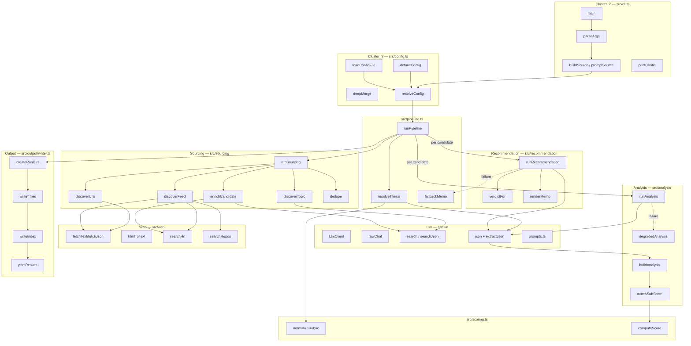
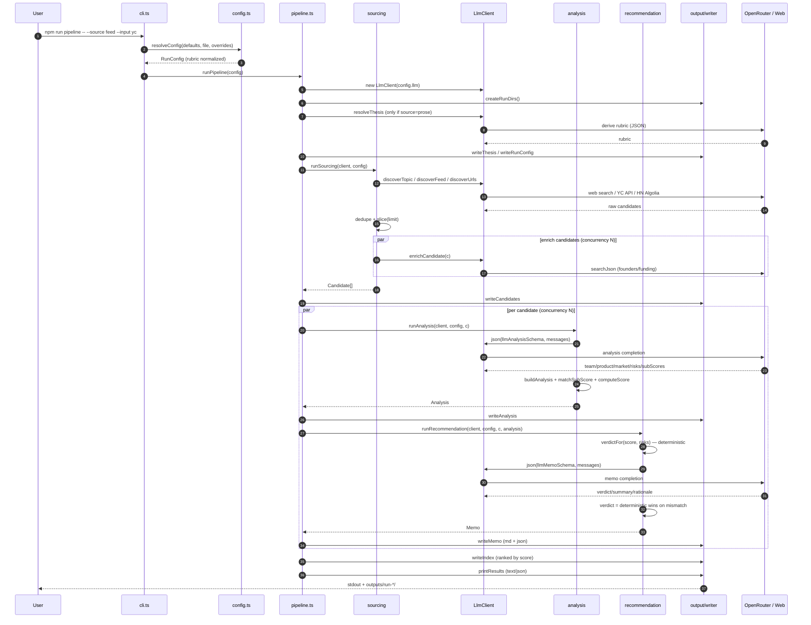

# Architecture: `emergence` — AI-augmented investment research pipeline

A TypeScript Node CLI that discovers startups, scores them against an investment thesis (rubric), and writes decision memos. 60 files, ~361 symbols, 27 execution flows.

## Module map (6 functional clusters)

| Cluster | Files | Role |
|---|---|---|
| **Cluster_2** (CLI) | `src/cli.ts` | Arg parsing, source selection, entry point |
| **Cluster_3** (Config) | `src/config.ts`, `src/scoring.ts` | Defaults, deep-merge, rubric/weight normalization |
| **Llm** | `src/llm/client.ts`, `src/llm/prompts.ts`, `src/sourcing/*` | OpenAI/OpenRouter client, JSON w/ repair, prompts |
| **Web** | `src/web/fetch.ts`, `src/web/hn.ts`, `src/web/github.ts` | HTTP fetch, HN (Algolia), GitHub |
| **Analysis** | `src/analysis/index.ts`, `src/pipeline.ts`, `src/scoring.ts` | Score candidates vs rubric |
| **Recommendation** | `src/recommendation/memo.ts` | Verdict + memo rendering |

## Execution flow

`main()` → `parseArgs` → `resolveConfig` → `runPipeline` → 3-stage loop → `output/writer`.

## Data flow detail

1. **Config resolution** (`resolveConfig`): `defaultConfig` ← `pipeline.config.json` ← CLI dot-path overrides (`--trail.journal.level`), then `zod` validation + `normalizeRubric` (weights → sum 1.0).

2. **Stage 1 — Sourcing** (`runSourcing`, `src/sourcing/index.ts:10`): picks one discovery mode (`topic` via search-model, `urls` via fetch+extract, `feed` via YC API/HN Algolia), dedupes, then enriches each candidate (founders/funding via `searchJson`, HN traction fallback).

3. **Stage 2 — Analysis** (`runAnalysis`, `src/analysis/index.ts:86`): LLM returns structured JSON (team/product/market/risks/subScores) validated by `zod`; `buildAnalysis` reconciles model sub-scores to rubric keys via `matchSubScore` and recomputes the score deterministically with `computeScore` (LLM never writes the number directly).

4. **Stage 3 — Recommendation** (`runRecommendation`, `src/recommendation/memo.ts:50`): `verdictFor` computes a rule-based verdict from score + risk severity; the LLM's verdict is accepted only if it agrees, otherwise the deterministic verdict wins. `renderMemo` emits a one-page markdown memo.

5. **Output** (`src/output/writer.ts`): timestamped `outputs/run-*/` dir with `thesis.md`, `candidates.json`, per-candidate `analyses/*.json` + `memos/*.md`, and a ranked `index.md`; `printResults` renders text or JSON to stdout.

Key resilience pattern: every LLM call goes through `LlmClient.json/searchJson` which strips markdown fences (`extractJson`), validates against `zod`, and feeds validation errors back to the model for repair (up to 3 retries). Failures degrade gracefully — `degradedAnalysis` and `fallbackMemo` keep the pipeline running.

## Sequence diagram

Notes on the diagram: the `par` blocks run with bounded concurrency (`config.concurrency`, default 4) via `mapWithConcurrency`, which preserves input order in the results array. LLM failures inside a candidate degrade to `degradedAnalysis` / `fallbackMemo` rather than aborting the run.
